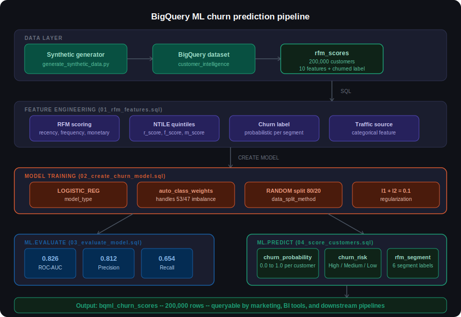

# Retail Churn BigQuery ML

A retail customer churn prediction pipeline built entirely in SQL using BigQuery ML.
Generates 200,000 synthetic retail customers, engineers RFM features, trains a
logistic regression classifier, and scores every customer with churn probability,
risk tier, and segment label. No Python, no containers, no infrastructure.

Companion repo (PyTorch MLP + TabNet): https://github.com/gbhorne/retail-churn-pytorch

---

## What this repo demonstrates

Most ML tutorials show you how to build a model. This repo shows how to build a
complete ML pipeline that a real business could run on a schedule. Every step
from raw data to scored customer records runs as a SQL query inside BigQuery.
The marketing team queries the output table directly. There is no serving
infrastructure to maintain.

The core architectural argument: for a batch scoring workload where data already
lives in BigQuery, a SQL-native ML pipeline has lower total cost of ownership
than any Python-based alternative, competitive accuracy, and zero operational
overhead. This repo proves that argument with working code and real metrics.

---

## Pipeline architecture



---

## Churn label definition

| Property | Value |
|----------|-------|
| Observation window | Full synthetic purchase history per customer |
| Prediction horizon | N/A (synthetic labels assigned at generation time) |
| Churn rule | Probabilistic per segment |
| Scoring timestamp | End of observation window |

In this synthetic dataset, churn represents a probabilistic likelihood of inactivity
based on behavioral segment rather than a fixed time-based definition. Because churn
labels are assigned probabilistically and not derived from recency, no feature
directly determines the target, avoiding feature leakage.

| Segment | Churn probability | Behavioral profile |
|---------|------------------|-------------------|
| Champions | 5% | High frequency, high spend, very recent |
| Loyal | 10% | Regular buyers, strong lifetime value |
| Potential | 40% | Moderate engagement, inconsistent |
| Recent | 25% | New customers, single or few purchases |
| At-Risk | 65% | Declining frequency, increasing recency |
| Hibernating | 85% | Long inactive, low historical engagement |

In a production deployment, churn would be defined as no purchase within a fixed
horizon (for example, 90 days) after a feature cutoff date. Features must be computed
strictly before that cutoff to prevent leakage:

```sql
-- Production pattern: enforce feature cutoff before label window
WITH feature_cutoff AS (
  SELECT DATE_SUB(CURRENT_DATE(), INTERVAL 90 DAY) AS cutoff
)
SELECT
  user_id,
  COUNT(DISTINCT order_id) AS frequency,
  SUM(sale_price)          AS monetary,
  DATE_DIFF(
    (SELECT cutoff FROM feature_cutoff),
    MAX(DATE(order_date)), DAY
  ) AS recency_days
FROM orders
WHERE order_date < (SELECT cutoff FROM feature_cutoff)
GROUP BY user_id
```

---

## Feature engineering deep dive

RFM (Recency, Frequency, Monetary) is the foundation of almost all retail customer
analytics. These three dimensions capture the behavioral signal that matters most
for churn prediction.

**Recency** measures how many days have passed since the customer's last purchase.
A customer who bought yesterday is almost certainly active. A customer who last
bought 400 days ago is almost certainly churned. Recency is computed as
DATE_DIFF(CURRENT_DATE(), DATE(last_order_date), DAY).

**Frequency** measures how many distinct orders the customer has placed. A single-
order customer who has not bought again is a fundamentally different risk profile
from a 20-order customer who recently went quiet. Frequency is COUNT(DISTINCT order_id).

**Monetary** measures total spend across all non-cancelled, non-returned orders.
High-value customers are worth more effort to retain and often have different churn
dynamics than low-value customers. Monetary is SUM(sale_price).

**NTILE scoring** converts the raw RFM values into 1-5 quintile scores using
BigQuery's NTILE window function. This normalization makes the scores comparable
across features regardless of their raw scale. A customer with r_score=1, f_score=5,
m_score=5 is a high-value loyal customer who has not bought recently: a classic
at-risk profile.

**Churn label** is assigned probabilistically at generation time. A customer in the
At-Risk segment has a 65% random chance of being labeled churned=1. This means the
model must learn the underlying feature distributions rather than memorizing a single
rule. In a production system the label would be derived from actual future purchase
behavior.

```sql
-- How NTILE scoring works in the pipeline
NTILE(5) OVER (ORDER BY DATE_DIFF(CURRENT_DATE(), DATE(last_order_date), DAY) ASC)
  AS r_score

-- Customers with r_score=5 bought most recently
-- Customers with r_score=1 have the highest recency_days (longest since purchase)
```

The full feature set used for model training:

| Feature | Type | Description |
|---------|------|-------------|
| recency_days | INTEGER | Days since last non-cancelled order |
| frequency | INTEGER | Count of distinct orders |
| monetary | FLOAT | Total spend across all orders |
| avg_order_value | FLOAT | Average spend per order |
| active_months | INTEGER | Distinct calendar months with a purchase |
| r_score | INTEGER | Recency quintile 1-5 (5 = most recent) |
| f_score | INTEGER | Frequency quintile 1-5 (5 = most frequent) |
| m_score | INTEGER | Monetary quintile 1-5 (5 = highest spend) |
| age | INTEGER | Customer age |
| traffic_source | STRING | Acquisition channel (Organic, Search, Email, Social, Display) |

---

## Model training deep dive

BQML logistic regression is the right starting point for this problem. It is
interpretable, fast, and on well-engineered tabular data it is often competitive
with far more complex models.

```sql
CREATE OR REPLACE MODEL `customer-churn-492703.customer_intelligence.bqml_churn_lr`
OPTIONS(
  model_type            = 'LOGISTIC_REG',
  input_label_cols      = ['churned'],
  auto_class_weights    = TRUE,
  data_split_method     = 'RANDOM',
  data_split_eval_fraction = 0.2,
  max_iterations        = 50,
  l1_reg                = 0.1,
  l2_reg                = 0.1
) AS
SELECT
  recency_days, frequency, monetary, avg_order_value,
  active_months, r_score, f_score, m_score, age,
  traffic_source, churned
FROM `customer-churn-492703.customer_intelligence.rfm_scores`
```

**model_type = LOGISTIC_REG** trains a logistic regression classifier. BQML also
supports BOOSTED_TREE_CLASSIFIER and DNN_CLASSIFIER. Logistic regression is the
correct baseline because it is the simplest model that can separate churners from
non-churners and its weights are directly interpretable.

**auto_class_weights = TRUE** automatically computes class weights inversely
proportional to class frequency. With a 53/47 churn split this is less critical
than it would be for a heavily imbalanced dataset, but it ensures the model does
not trivially optimize for the majority class.

**data_split_method = RANDOM with data_split_eval_fraction = 0.2** holds out 20%
of rows for evaluation. BigQuery ML handles this internally. In production with
temporal data this would be replaced with a CUSTOM split using a date boundary.

**l1_reg = 0.1 and l2_reg = 0.1** apply L1 and L2 regularization. L1 (Lasso)
pushes less useful feature weights toward zero, effectively performing feature
selection. L2 (Ridge) penalizes large weights and prevents overfitting.

**max_iterations = 50** caps the optimization at 50 gradient descent steps. The
model converged well within this limit on the reference run.

---

## Evaluation deep dive

```sql
SELECT
  ROUND(precision, 4)  AS precision,
  ROUND(recall, 4)     AS recall,
  ROUND(accuracy, 4)   AS accuracy,
  ROUND(f1_score, 4)   AS f1_score,
  ROUND(log_loss, 4)   AS log_loss,
  ROUND(roc_auc, 4)    AS roc_auc
FROM ML.EVALUATE(
  MODEL `customer-churn-492703.customer_intelligence.bqml_churn_lr`
)
```

**ROC-AUC: 0.826** measures the probability that the model ranks a randomly chosen
churner above a randomly chosen non-churner. This is the primary comparison metric
against the PyTorch models in the companion repo.

**Precision: 0.812** means that when the model predicts a customer will churn, it
is correct 81.2% of the time. High precision reduces wasted campaign spend on
customers who were not actually at risk.

**Recall: 0.654** means the model correctly identifies 65.4% of all actual churners.
The remaining 34.6% are missed. This is the most business-critical metric for a
win-back campaign. The PyTorch MLP improves this to 81% through threshold
optimization, which is the primary business argument for the more complex model.

**F1: 0.725** is the harmonic mean of precision and recall. It provides a balanced
view of classification performance, penalizing models that sacrifice one for the other.

**Log loss: 0.521** measures how well-calibrated the output probabilities are. Lower
is better. A well-calibrated model whose predicted probability of 0.7 would be
correct approximately 70% of the time.

---

## Scoring and output

```sql
CREATE OR REPLACE TABLE `customer-churn-492703.customer_intelligence.bqml_churn_scores` AS
SELECT
  r.user_id,
  r.recency_days, r.frequency, r.monetary,
  r.r_score, r.f_score, r.m_score,
  r.traffic_source, r.country, r.age,
  p.predicted_churned                                        AS churn_prediction,
  (SELECT prob FROM UNNEST(p.predicted_churned_probs)
   WHERE label = 1)                                          AS churn_probability,
  CASE
    WHEN (SELECT prob FROM UNNEST(p.predicted_churned_probs)
          WHERE label = 1) >= 0.7 THEN 'High'
    WHEN (SELECT prob FROM UNNEST(p.predicted_churned_probs)
          WHERE label = 1) >= 0.4 THEN 'Medium'
    ELSE 'Low'
  END                                                        AS churn_risk,
  CASE
    WHEN r.r_score >= 4 AND r.f_score >= 4 THEN 'Champions'
    WHEN r.r_score >= 3 AND r.f_score >= 3 THEN 'Loyal'
    WHEN r.r_score >= 4 AND r.f_score <= 2 THEN 'Recent'
    WHEN r.r_score <= 2 AND r.f_score >= 3 THEN 'At-Risk'
    WHEN r.r_score <= 2 AND r.f_score <= 2 THEN 'Hibernating'
    ELSE 'Potential'
  END                                                        AS rfm_segment,
  CURRENT_TIMESTAMP()                                        AS scored_at
FROM `customer-churn-492703.customer_intelligence.rfm_scores` r
JOIN ML.PREDICT(
  MODEL `customer-churn-492703.customer_intelligence.bqml_churn_lr`,
  (SELECT * FROM `customer-churn-492703.customer_intelligence.rfm_scores`)
) p ON r.user_id = p.user_id
```

**ML.PREDICT** runs every customer through the trained model and returns a
predicted_churned_probs array containing the probability for each class label.
The UNNEST call unpacks that array to extract the churn probability for label=1.

**Churn risk tiers** bucket the continuous probability into High (>=0.7), Medium
(>=0.4), and Low (<0.4). These are business decisions, not model parameters. A
campaign manager can adjust them without retraining the model.

**RFM segment** is assigned using the NTILE scores independently of the model
prediction. A customer can be a Champion (high RFM scores) with High churn risk
(model prediction). These are complementary signals: the segment describes
behavioral history, the churn risk describes future probability.

---

## How to use the output table

The bqml_churn_scores table is the deliverable. Marketing teams query it directly.

Pull your high-value at-risk customers for a win-back campaign:

```sql
SELECT
  user_id, rfm_segment, churn_risk,
  ROUND(churn_probability * 100, 1) AS churn_pct,
  monetary
FROM `customer-churn-492703.customer_intelligence.bqml_churn_scores`
WHERE churn_risk = 'High'
ORDER BY monetary DESC
LIMIT 1000
```

Prioritize by expected recovery value (spend times churn probability):

```sql
SELECT
  user_id, rfm_segment, churn_risk,
  monetary,
  ROUND(monetary * churn_probability, 2) AS expected_loss
FROM `customer-churn-492703.customer_intelligence.bqml_churn_scores`
WHERE churn_risk = 'High'
ORDER BY expected_loss DESC
```

Suppress low-value inactive customers from campaigns:

```sql
SELECT user_id
FROM `customer-churn-492703.customer_intelligence.bqml_churn_scores`
WHERE rfm_segment = 'Hibernating'
  AND churn_risk = 'Low'
  AND monetary < 50
```

---

## Results

| Metric | Value |
|--------|-------|
| ROC-AUC | 0.826 |
| Precision | 0.812 |
| Recall | 0.654 |
| F1 score | 0.725 |
| Log loss | 0.521 |
| Training time | 60 to 120 seconds (slot-dependent) |
| Customers scored | 200,000 |
| Output table | bqml_churn_scores |

---

## Data split note

This pipeline uses RANDOM data split. Because customer histories are synthetically
generated without temporal ordering, a random split is appropriate for this experiment.
In a production churn model with real transaction data, a time-based split must be used:

```sql
CREATE OR REPLACE MODEL `project.dataset.churn_model`
OPTIONS(
  model_type        = 'LOGISTIC_REG',
  data_split_method = 'CUSTOM',
  data_split_col    = 'is_eval'
)
AS SELECT
  *,
  IF(last_order_date >= '2024-01-01', TRUE, FALSE) AS is_eval
FROM `project.dataset.rfm_scores`
```

---

## Reproducible evaluation queries

```sql
SELECT * FROM ML.EVALUATE(
  MODEL `customer-churn-492703.customer_intelligence.bqml_churn_lr`
)
```

```sql
SELECT * FROM ML.ROC_CURVE(
  MODEL `customer-churn-492703.customer_intelligence.bqml_churn_lr`
)
ORDER BY threshold DESC
```

---

## Cost profile

| Component | Cost model |
|-----------|-----------|
| Data generation | One-time load job, negligible cost |
| Model training | On-demand: billed per TB of training data scanned |
| Batch scoring | ML.PREDICT billed per TB scanned |
| Storage | rfm_scores approx 6.7MB, bqml_churn_scores approx 8MB |
| Infrastructure | None (fully serverless) |

---

## Pipeline

| File | Purpose |
|------|---------|
| generate_synthetic_data.py | Generates 200,000 synthetic customers, writes to BigQuery |
| sql/01_rfm_features.sql | Validates rfm_scores table |
| sql/02_create_churn_model.sql | Trains BQML logistic regression |
| sql/03_evaluate_model.sql | Evaluates model: AUC, precision, recall |
| sql/04_score_customers.sql | Scores all customers, writes bqml_churn_scores |
| sql/05_validate_scores.sql | Validates scored output by segment and risk tier |
| bq_run.ps1 | PowerShell helper to run SQL files against BigQuery |

---

## Synthetic data disclaimer

All customer data is synthetically generated using numpy random distributions.
No real customer records, PII, or proprietary retail data was used.
The data simulates realistic RFM behavioral patterns for ML pipeline demonstration.

---

## License

MIT
